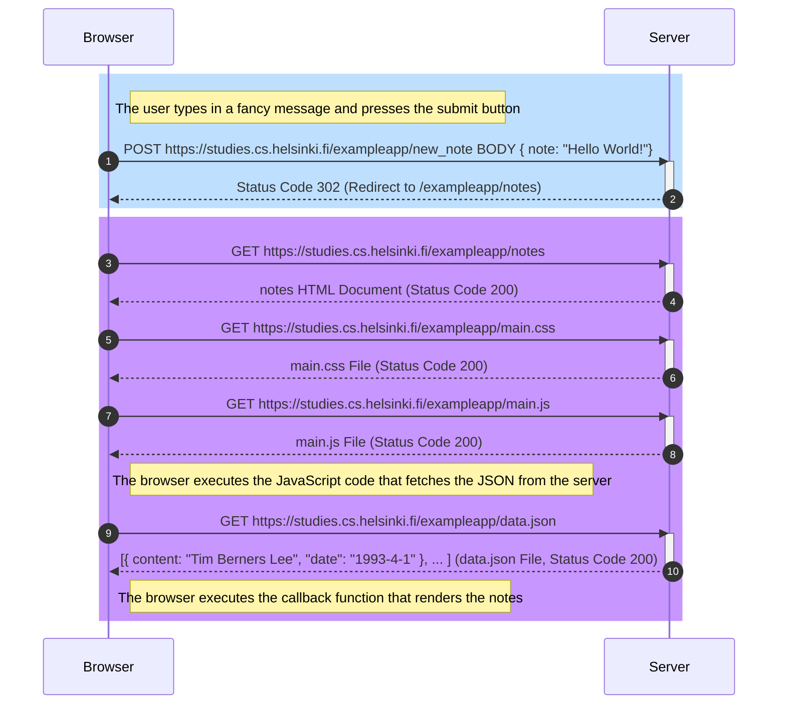

# Sequence of requests and responses when user adds a new note

```mermaid
sequenceDiagram
    autonumber
    participant B as Browser
    participant S as Server

    rect rgb(191, 223, 255)
    Note right of B: The user types in a fancy message and presses the submit button

    B->>S: POST https://studies.cs.helsinki.fi/exampleapp/new_note BODY { note: "Hello World!"}
    activate S
    S-->>B: Status Code 302 (Redirect to /exampleapp/notes)
    deactivate S
    end

    rect rgb(200, 150, 255)
    B->>S: GET https://studies.cs.helsinki.fi/exampleapp/notes
    activate S
    S-->>B: notes HTML Document (Status Code 200)
    deactivate S

    B->>S: GET https://studies.cs.helsinki.fi/exampleapp/main.css
    activate S
    S-->>B: main.css File (Status Code 200)
    deactivate S

    B->>S: GET https://studies.cs.helsinki.fi/exampleapp/main.js
    activate S
    S-->>B: main.js File (Status Code 200)
    deactivate S

    Note right of B: The browser executes the JavaScript code that fetches the JSON from the server

    B->>S: GET https://studies.cs.helsinki.fi/exampleapp/data.json
    activate S
    S-->>B: [{ content: "Tim Berners Lee", "date": "1993-4-1" }, ... ] (data.json File, Status Code 200)
    deactivate S

    Note right of B: The browser executes the callback function that renders the notes
    end
```
