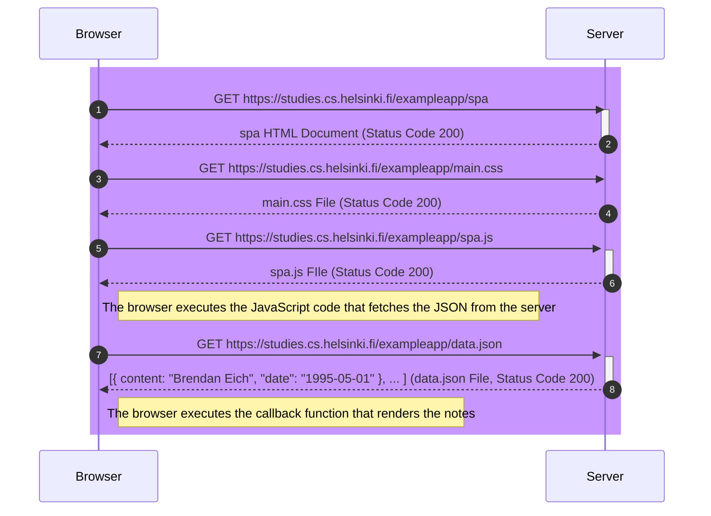

# Single page app diagram 

```mermaid
sequenceDiagram
    autonumber
    participant B as Browser
    participant S as Server

    rect rgb(200, 150, 255
    B->>S: GET https://studies.cs.helsinki.fi/exampleapp/spa
    activate S
    S-->>B: spa HTML Document (Status Code 200)
    deactivate S

    B->>S: GET https://studies.cs.helsinki.fi/exampleapp/main.css
    activate S
    S-->>B: main.css File (Status Code 200)

    B->>S: GET https://studies.cs.helsinki.fi/exampleapp/spa.js
    activate S
    S-->>B: spa.js FIle (Status Code 200)
    deactivate S

    Note right of B: The browser executes the JavaScript code that fetches the JSON from the server

    B->>S: GET https://studies.cs.helsinki.fi/exampleapp/data.json
    activate S
    S-->>B: [{ content: "Brendan Eich", "date": "1995-05-01" }, ... ] (data.json File, Status Code 200)
    deactivate S

    Note right of B: The browser executes the callback function that renders the notes
    end
```
