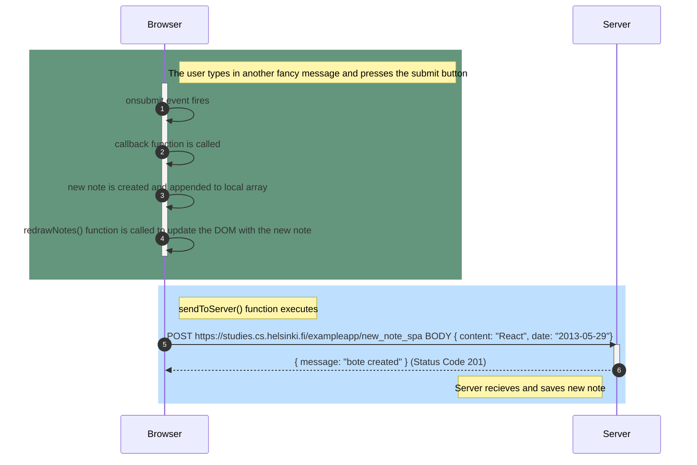

# New note in single app diagram

```mermaid
sequenceDiagram
    autonumber
    participant B as Browser
    participant S as Server

    rect rgb(100, 150, 125)
    Note right of B: The user types in another fancy message and presses the submit button

    activate B
    B->>B: onsubmit event fires
    B->>B: callback function is called
    B->>B: new note is created and appended to local array
    B->>B: redrawNotes() function is called to update the DOM with the new note
    deactivate B

    end

    rect rgb(191, 223, 255)
    Note right of B: sendToServer() function executes
    B->>S: POST https://studies.cs.helsinki.fi/exampleapp/new_note_spa BODY { content: "React", date: "2013-05-29"}
    activate S
    S-->>B: { message: "bote created" } (Status Code 201)
    deactivate S

    Note left of S: Server recieves and saves new note
    end
```
